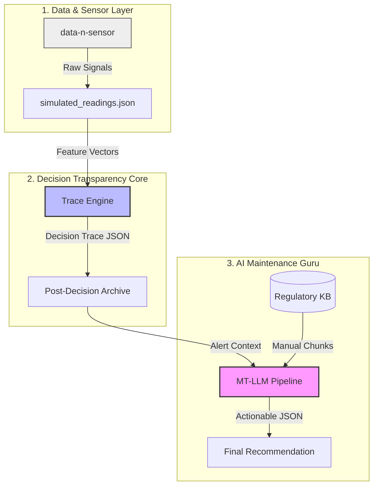

# 🏭 IOT-Trace: Explainable Wastewater Monitoring System

## 📌 Overview
**IOT-Trace** is an end-to-end industrial monitoring solution that prioritizes **Decision Transparency**. Unlike traditional "black-box" AI models, IOT-Trace records the exact reasoning path of every alert, integrates it with regulatory knowledge bases, and provides actionable maintenance recommendations.

The system is designed to build trust between AI and industrial engineers by making every automated decision inspectable, replayable, and auditable.

---

## 🏗️ System Architecture & Pipeline

The project follows a linear pipeline from raw sensor simulation to final maintenance instructions.



---

## 📂 Project Components

### 1. `ui/app.py` (The Interactive Dashboard)
The primary entry point. A premium Streamlit dashboard that:
- **Auto-Simulates**: Automatically runs the sensor simulation on startup.
- **Visualizes**: Shows live sensor readings (pH, BOD, COD, Temp).
- **Explains**: Displays the exact rule-based "Decision Trace" behind every alert.
- **Advises**: Shows AI-generated explanations and tiered action plans.

### 2. `trace-engine`
The deterministic heart of the system.
- **Rules-Based Inference**: Applies multi-tier thresholds (Moderate vs Extreme).
- **Trace Generation**: Produces a `reasoning_trace` showing exactly which rules fired.

### 3. `mt-llm`
The interpretation layer that adds human context to technical traces.
- **Knowledge Retrieval**: Fetches relevant regulatory guidelines (e.g., CEQMS 2018).
- **LLM Explainer**: Converts technical traces into human-readable narratives and dispatch instructions.

---

## 🚀 Getting Started

### Prerequisites
- Python 3.10+
- `pip`

### Installation
1. Clone the repository.
2. Install dependencies:
   ```bash
   pip install -r requirements.txt
   ```

### Execution

#### 📺 The Interactive Dashboard (Recommended)
Simply run the Streamlit app. It will initialize the engine and run the simulation automatically:
```bash
streamlit run ui/app.py
```

#### 🛠️ The CLI Pipeline
To run the full end-to-end pipeline via terminal:
```bash
python run_full_pipeline.py
```

#### 🧹 Project Cleanup
To clear all generated traces, logs, and simulation data for a fresh demo:
```bash
python utils/cleanup_all.py
```

---

## 🧠 Core Philosophy: "Trace First"
Explainability should be **intrinsic**, not post-hoc.
- **Traditional AI**: Guess -> Post-decision explanation (often hallucinated).
- **IOT-Trace**: Record path -> Logical retrieval -> Verified advice.

**If the system cannot show how it reasoned, it should not be trusted.**
